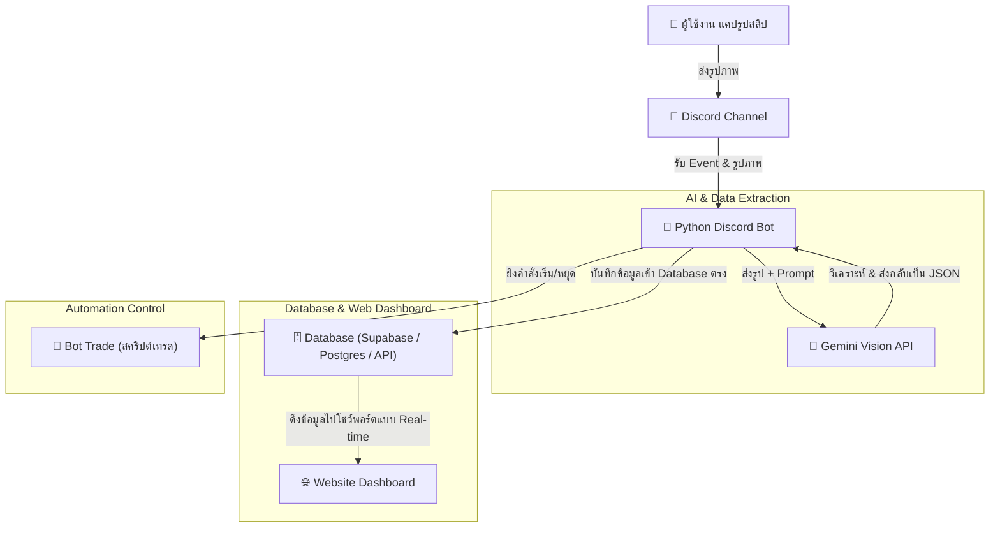

# แผนพัฒนาระบบบอท Discord สำหรับบันทึกรายการธุรกรรม (หุ้น & คริปโต) ด้วย AI [เวอร์ชันต่อตรง Database]

เอกสารนี้สรุปแนวคิด สถาปัตยกรรมระบบ และขั้นตอนการพัฒนาบอท Discord โดยเชื่อมต่อตรงเข้าสู่ **ฐานข้อมูลเว็บไซต์ (Database/API)** โดยตรงโดยไม่ผ่าน Google Sheets เพื่อประสิทธิภาพความเร็วและการแสดงผลแบบเรียลไทม์

---

## 🎯 เป้าหมายของระบบ (System Goal)

สร้างบอท Discord ส่วนตัวที่อำนวยความสะดวกสูงสุดในการบันทึกประวัติการลงทุน:
1. **ส่งภาพแคปเจอร์** รายการธุรกรรมซื้อหุ้นหรือคริปโตเข้าไปใน Discord
2. **วิเคราะห์รูปภาพด้วย AI** (ใช้ Gemini Vision API) เพื่อถอดข้อมูลตัวเลขและข้อความออกมาโดยอัตโนมัติ
3. **จัดเก็บข้อมูลตรงเข้าสู่ Database** ของเว็บไซต์คุณ (เช่น Supabase, PostgreSQL, Firebase หรือผ่าน Web API)
4. **แสดงผลแบบเรียลไทม์** บนหน้าจอแดชบอร์ดเว็บไซต์พอร์ตโฟลิโอของคุณ

---

## 🛠️ สถาปัตยกรรมของระบบที่เลือก (System Architecture)

ระบบนี้เชื่อมโยงหน้าบ้าน Discord เข้ากับฐานข้อมูลหลังบ้านของเว็บไซต์คุณโดยตรง:

---

## 📌 โครงสร้างข้อมูลที่ AI จะถอดแยกออกมา (Extracted Data Schema)

เมื่อส่งภาพแคปรายการเทรดเข้ามา AI จะทำการแปลงภาพเป็นข้อมูลเพื่อนำไปบันทึกลง Table ใน Database:

| ฟิลด์ข้อมูล (Field) | ประเภทข้อมูล (Type) | คำอธิบาย |
| :--- | :--- | :--- |
| **id** | `UUID` / `SERIAL` | คีย์หลักสำหรับแยกแถวข้อมูล (Primary Key) |
| **asset** | `VARCHAR` (เช่น `BTC`, `AAPL`) | ชื่อหุ้นหรือเหรียญคริปโต |
| **transaction_type**| `VARCHAR` (`BUY` / `SELL`) | ประเภทธุรกรรม |
| **price** | `NUMERIC` / `FLOAT` | ราคาซื้อต่อหน่วย |
| **quantity** | `NUMERIC` / `FLOAT` | จำนวนหน่วยที่ซื้อขาย |
| **total_amount** | `NUMERIC` / `FLOAT` | ยอดเงินรวมทั้งหมด |
| **timestamp** | `TIMESTAMP` | วันและเวลาที่ทำรายการจริง |
| **platform** | `VARCHAR` (เช่น `Bitkub`) | แพลตฟอร์มที่ใช้เทรด |

---

## 🚀 แผนการดำเนินงาน (Action Plan)

การพัฒนาจะแบ่งออกเป็น 4 เฟสหลัก:

### เฟสที่ 1: ตั้งค่าบัญชีและเตรียมคีย์ระบบ
1. **สร้างบอท Discord:** สมัครแอปพลิเคชันที่ Discord Developer Portal และดึงบอทเข้าสู่ Server ส่วนตัว
2. **สร้าง Gemini API Key:** สมัครใช้บริการเพื่อดึงกุญแจเชื่อมต่อ AI Vision
3. **เตรียม Database / API:** เชื่อมต่อกับระบบหลังบ้านของเว็บไซต์ของคุณ (เช่น เชื่อมต่อผ่าน Supabase Python SDK หรือยิง REST API)

### เฟสที่ 2: พัฒนาตัวบอท Python (สมองส่วนวิเคราะห์รูป)
1. เขียนบอทให้สามารถรอรับรูปภาพสลิปที่อัปโหลดในช่องแชทที่กำหนด
2. เขียนโค้ดส่งภาพนั้นไปหา **Gemini API** เพื่อวิเคราะห์ข้อมูล
3. แสดงผลตัวอย่างที่ AI อ่านได้พร้อมปุ่ม **[ยืนยันบันทึกข้อมูล]** หรือ **[ยกเลิก]** 

### เฟสที่ 3: เขียนระบบเชื่อมต่อฐานข้อมูลตรง (Database Integration)
1. เขียนโค้ดเชื่อมต่อฐานข้อมูลโดยตรง หรือยิงคำสั่ง POST ไปยัง API Endpoint ของเว็บไซต์คุณ
2. ส่งข้อมูลที่ยืนยันแล้วเข้าไปบันทึกใน Database ทันที

### เฟสที่ 4: ลิงก์เข้าเว็บไซต์ และสั่งงาน Bot Trade
1. พัฒนาหรือปรับปรุงหน้าเว็บ Dashboard ให้แสดงพอร์ตรวมจากการดึงข้อมูลใน Database
2. เชื่อมต่อปุ่มใน Discord เพื่อใช้สั่งการ Bot Trade
